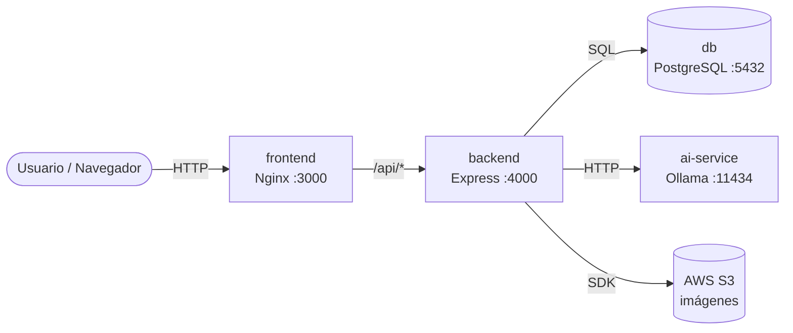
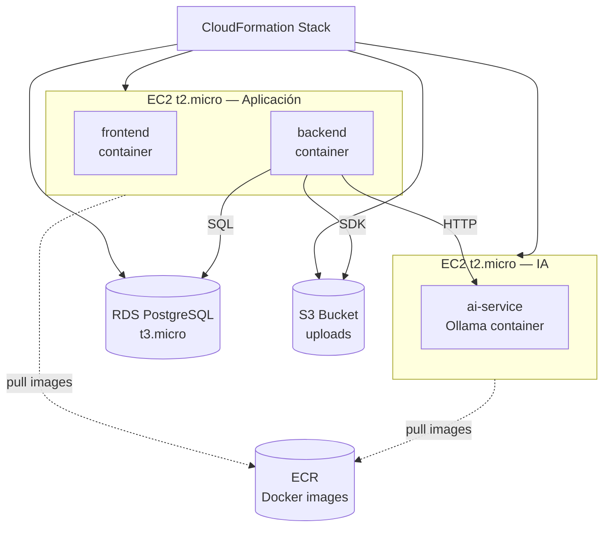

# 01 — Arquitectura General de Nexo

## ¿Qué es Nexo?

Nexo resuelve un problema cotidiano: agendar una cita en una peluquería, un fisioterapeuta o un técnico de celulares suele requerir llamadas telefónicas, mensajes de WhatsApp que se pierden, y no hay forma de ver la disponibilidad real en tiempo real. Nexo centraliza todo eso en una plataforma web.

El sistema conecta dos tipos de usuarios: **emprendedores** (dueños de negocio) que publican sus servicios, horarios y disponibilidad; y **clientes** que buscan, reservan y califican. Un tercer rol, **admin**, gestiona la plataforma globalmente. Lo que hace diferente a Nexo es que la búsqueda no es por palabras exactas — un cliente puede escribir "quiero acicalarme" y el sistema entiende que está buscando una peluquería, gracias a la búsqueda semántica con IA.

---

## Los 4 contenedores

Nexo corre como 4 servicios independientes coordinados por Docker Compose:

| Contenedor | Tecnología | Responsabilidad |
|------------|-----------|-----------------|
| `frontend` | React 18 + Vite → Nginx | Interfaz de usuario; en dev usa Vite con hot reload, en producción Nginx sirve los archivos compilados |
| `backend` | Node.js 20 + Express | API REST, lógica de negocio, autenticación JWT, conexión a DB y a Ollama |
| `ai-service` | Ollama | Modelos de IA locales: `nomic-embed-text` (embeddings) y `qwen2.5:0.5b` (chatbot) |
| `db` | PostgreSQL 15 | Base de datos relacional; solo existe como contenedor en dev y staging, en producción se usa AWS RDS |

### ¿Quién habla con quién?



**Regla clave:** el frontend nunca llama a Ollama directamente. Toda la IA pasa por el backend, que actúa como intermediario y controla el acceso.

---

## Por qué contenedores separados

Imagina que Nexo fuera una empresa con departamentos. El departamento de atención al cliente (frontend) no necesita saber cómo funciona la cocina (base de datos). Si la cocina tiene un problema, el resto puede seguir trabajando.

Con contenedores pasa lo mismo:
- Si Ollama se cae, el agendamiento de citas sigue funcionando (el chatbot simplemente muestra un mensaje de error).
- Si necesitas más capacidad para la IA, puedes mover `ai-service` a una máquina más potente sin tocar nada más.
- Cada contenedor tiene exactamente las dependencias que necesita — el frontend no tiene Node.js para backend ni PostgreSQL client.

---

## Los 3 entornos

| Característica | DEV | STG | PRD |
|----------------|-----|-----|-----|
| Frontend | Vite dev server (hot reload) puerto 5173 | Nginx + build estático puerto 3000 | Nginx + build estático puerto 3000 |
| Backend | nodemon (reinicia al guardar) | Node directo | Node directo |
| Base de datos | Contenedor Docker | Contenedor Docker | AWS RDS PostgreSQL |
| Storage de imágenes | Volumen Docker local | Volumen Docker local | AWS S3 |
| IA | Ollama local | Ollama local | Ollama en EC2 separada |
| Restart automático | No | Sí (`unless-stopped`) | Sí (`unless-stopped`) |
| Health checks | No | Sí | Sí |
| Cómo levantar | `make dev` | `make stg` | `make prd` |

Los tres entornos usan el mismo archivo base `docker-compose.yml` y le aplican un archivo de overrides encima:

```bash
# DEV: base + dev overrides
docker compose -f docker-compose.yml -f docker-compose.dev.yml up

# STG: base + staging overrides
docker compose -f docker-compose.yml -f docker-compose.stg.yml up -d

# PRD: base + production overrides (sin contenedor db)
docker compose -f docker-compose.yml -f docker-compose.prd.yml up -d
```

---

## Arquitectura en AWS (producción)

En producción, los contenedores corren en AWS usando ECS (Elastic Container Service) sobre instancias EC2 del Free Tier:



La Ollama necesita su propia EC2 porque los modelos de IA consumen ~1GB de RAM solo para cargarse — una EC2 t2.micro (1GB RAM) no puede compartir ese espacio con el frontend y backend.

Todo el stack se crea con un solo comando de CloudFormation y se elimina con otro, lo que significa que el costo vuelve a $0 cuando no lo usas. Ver [07 — Despliegue AWS](./07-despliegue-aws.md) para los pasos completos.

---

## Costos en AWS Free Tier

| Servicio | Qué incluye gratis | Duración |
|----------|-------------------|----------|
| EC2 t2.micro | 750 horas/mes (≈ 1 instancia corriendo todo el mes) | 12 meses |
| RDS t3.micro | 750 horas/mes | 12 meses |
| S3 | 5 GB almacenamiento + 20.000 GET + 2.000 PUT | 12 meses |
| ECS | Gratis (pagas la EC2 que usa) | Siempre |
| ECR | 500 MB de almacenamiento de imágenes | Siempre |
| CloudFormation | Gratis | Siempre |

> ⚠️ **Importante:** Nexo usa **2 instancias EC2** (una para app, otra para IA). El Free Tier cubre 750 horas/mes en total entre todas las instancias t2.micro. Con 2 instancias corriendo las 24 horas llegas a ~1.440 horas/mes, lo que supera el límite. La estrategia recomendada: levantar el stack solo cuando lo necesites y eliminarlo cuando termines. 10 minutos de prueba cuesta aproximadamente $0.003 USD.

---

## ¿Qué sigue?

Si nunca has usado Docker → [02 — Docker desde Cero](./02-docker.md)

Si ya sabes Docker y quieres entender la API → [03 — Backend](./03-backend.md)
