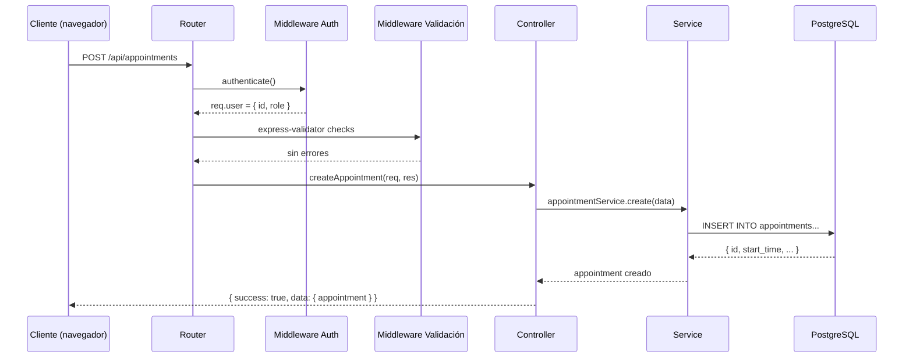

# 03 — Backend — Node.js y Express

## Estructura de carpetas

```
backend/src/
├── app.js          ← Bootstrap: configura Express, monta todas las rutas
├── routes/         ← Mapean URLs a controladores
├── controllers/    ← Reciben la petición HTTP, llaman al service, retornan JSON
├── services/       ← Lógica de negocio pura, sin saber nada de HTTP
├── middlewares/    ← Funciones que se ejecutan antes del controlador
└── utils/          ← Herramientas reutilizables (db, cosine, haversine)
```

La analogía de un restaurante ayuda a entender la separación:

| Capa | Analogía | Responsabilidad |
|------|----------|-----------------|
| `routes/` | Recepción | "La mesa 5 pidió el menú de carnes, te la mando al mesero de esa zona" |
| `middlewares/` | Seguridad de la entrada | Verifica que tienes reserva (token JWT válido) antes de dejarte pasar |
| `controllers/` | Mesero | Toma el pedido, lo lleva a la cocina, trae el plato al cliente |
| `services/` | Cocina | Prepara la comida — aquí vive la lógica real del negocio |
| `utils/db.js` | Despensa | Los ingredientes: conexión a la base de datos |

---

## Flujo completo de una petición HTTP



Todo el backend usa **CommonJS** (`require` / `module.exports`). No hay ES Modules.

### Contrato de respuesta — siempre el mismo

```js
// Éxito
{ success: true, data: { ... } }    // HTTP 200 o 201

// Error
{ success: false, error: "mensaje" } // HTTP 4xx o 5xx
```

---

## Autenticación JWT — qué es y cómo funciona

Un JWT (JSON Web Token) es como un **pasaporte digital**. Tiene tres partes separadas por puntos:

```
eyJhbGciOiJIUzI1NiJ9.eyJpZCI6IjEyMyIsInJvbGUiOiJjbGllbnRlIn0.ABC123
     header                        payload                      firma
```

- **Header**: algoritmo de firma (HS256)
- **Payload**: datos del usuario (id, role, email) — son legibles por cualquiera
- **Firma**: `HMAC(header + payload, JWT_SECRET)` — solo el servidor puede generarla y verificarla

Cualquiera puede leer el payload de un JWT (está en Base64). Pero **nadie puede falsificar la firma** sin conocer el `JWT_SECRET`. Si alguien modifica el payload para cambiar su rol a `admin`, la firma ya no coincide y el servidor rechaza el token.

### Flujo completo en Nexo

```
1. Cliente hace POST /api/auth/login con email + password
2. Backend verifica password con bcrypt
3. Backend genera token: jwt.sign({ id, role, email }, JWT_SECRET, { expiresIn: '7d' })
4. Token llega al navegador → se guarda en localStorage como 'nexo_token'
5. En cada request siguiente, el Axios interceptor agrega: Authorization: Bearer <token>
6. El middleware authenticate() verifica la firma y extrae req.user
7. Si el token expiró (7 días) → 401 → el interceptor hace logout y redirige a login
```

El `JWT_SECRET` en `.env` es lo único que protege este sistema. En producción debe ser una cadena aleatoria larga (mínimo 32 caracteres).

---

## Los 3 roles y protección de rutas

El middleware `auth.js` exporta dos funciones:

```js
// Verifica que el token sea válido y agrega req.user
const authenticate = (req, res, next) => { ... }

// Verifica que req.user.role esté en la lista permitida
const requireRole = (...roles) => (req, res, next) => { ... }
```

Se usan en cadena en las rutas:

```js
// Solo emprendedores pueden crear servicios
router.post('/', authenticate, requireRole('emprendedor'), createService);

// Solo admins pueden cambiar roles
router.patch('/:id/role', authenticate, requireRole('admin'), updateRole);

// Clientes y emprendedores pueden ver sus citas
router.get('/', authenticate, requireRole('cliente', 'emprendedor'), getAppointments);
```

---

## Conexión a PostgreSQL con pool de conexiones

```js
// backend/src/utils/db.js
const { Pool } = require('pg');

const pool = new Pool({
  host: process.env.DB_HOST,   // 'db' en Docker, endpoint RDS en producción
  port: process.env.DB_PORT,
  database: process.env.DB_NAME,
  user: process.env.DB_USER,
  password: process.env.DB_PASSWORD,
});

module.exports = pool;
```

Sin pool, cada request HTTP abriría una conexión TCP a PostgreSQL (lento, caro) y la cerraría al terminar. Con pool, se mantienen N conexiones abiertas y se reutilizan entre requests. La librería `pg` gestiona el pool automáticamente.

Uso en un controlador:

```js
const pool = require('../utils/db');

const { rows } = await pool.query(
  'SELECT * FROM stores WHERE is_active = true AND city = $1',
  [city]   // parámetros separados para prevenir SQL injection
);
```

> ⚠️ **Importante:** Siempre usa parámetros (`$1`, `$2`) en las queries, nunca interpolación de strings. `WHERE city = '${city}'` permite SQL injection. `WHERE city = $1` con `[city]` como parámetro es seguro.

---

## Lógica de slots de disponibilidad

Esta es la lógica de negocio más crítica del sistema. Está en `services/availability.service.js`.

```
Pregunta: ¿qué horarios están disponibles para el servicio X en la tienda Y el día Z?

1. Obtener horario de la tienda ese día
   → SELECT * FROM business_hours WHERE store_id = Y AND day_of_week = día_semana(Z)

2. Si is_open = false → retornar [] (tienda cerrada)

3. Generar todos los slots posibles
   → open_time = "09:00", close_time = "18:00", duration = 45 minutos
   → slots: [09:00-09:45, 09:45-10:30, 10:30-11:15, 11:15-12:00, ...]

4. Obtener citas existentes ese día
   → SELECT start_time, end_time FROM appointments
      WHERE store_id = Y AND DATE(start_time) = Z AND status != 'cancelled'

5. Marcar cada slot como unavailable si se cruza con alguna cita existente

6. Retornar array:
   [
     { start: "09:00", end: "09:45", available: true },
     { start: "09:45", end: "10:30", available: false },  ← cita ocupada
     { start: "10:30", end: "11:15", available: true },
     ...
   ]
```

### Reglas de negocio de las citas

- `start_time` debe ser en el futuro y dentro del horario de la tienda
- No puede haber solapamiento con citas existentes (`status != 'cancelled'`)
- `end_time = start_time + service.duration_minutes`
- Un cliente solo puede cancelar/reagendar si `status IN ('pending', 'confirmed')` Y `start_time > NOW() + 2 horas`
- Reagendar también requiere `allow_reschedule = true` (lo activa el emprendedor)
- Las citas con `status = 'completed'` son inmutables

---

## El chatbot — flujo técnico completo

El endpoint `POST /api/chat` (requiere JWT) ejecuta este flujo:

```
"quiero acicalarme en Bogotá"
         │
         ▼
[PASO 1] qwen2.5:0.5b — normaliza la intención
         Entrada: mensaje del usuario
         Salida: { searchText: "arreglo personal corte cabello", city: "bogotá",
                   maxPrice: null, isAppointmentRelated: true }
         │
         ▼ (si isAppointmentRelated = false → respuesta canned, fin)
         │
[PASO 2] nomic-embed-text — genera embedding del searchText
         Salida: vector de 768 números flotantes
         │
[PASO 3] Node.js — similitud coseno contra embeddings de tiendas en DB
         Obtiene todas las tiendas activas con embedding IS NOT NULL
         Filtra por ciudad si se detectó
         Calcula score = cosineSimilarity(searchEmbedding, storeEmbedding)
         │
[PASO 4A] Si ninguna tienda tiene score >= 0.60:
          → buildNotFoundMessage() — sin llamar a qwen
          → stores: []
          FIN
         │
[PASO 4B] Si hay tiendas con score >= 0.60:
          → Ordenar por score, tomar top 3
          → Filtrar servicios por maxPrice si se indicó
          → Llamar a qwen con SOLO los datos reales de esas tiendas
          → Respuesta natural en español
          FIN
```

El umbral 0.60 fue calibrado con mediciones reales:
- "corte cabello" vs Salón Valentina: **0.7633** ✅
- "fisioterapia" vs Dr. Martínez: **0.6628** ✅
- "xbox" vs cualquier tienda: máximo **0.5839** ❌

---

## Sistema de uploads

El endpoint `POST /api/upload/image` (requiere auth) maneja imágenes de tiendas y servicios. El comportamiento cambia según la variable de entorno `STORAGE_TYPE`:

| `STORAGE_TYPE` | Comportamiento |
|----------------|----------------|
| `local` (dev) | Guarda en `/app/uploads` dentro del contenedor (volumen Docker) |
| `s3` (producción) | Sube a AWS S3 usando el AWS SDK |

El frontend accede a las imágenes guardadas localmente en `/static/nombre-archivo.jpg` (Nginx hace proxy de `/static/` al backend).

---

## Variables de entorno — para qué sirve cada una

| Variable | Dónde se usa | Descripción |
|----------|-------------|-------------|
| `DB_HOST` | `utils/db.js` | `db` en Docker, endpoint de RDS en producción |
| `DB_PORT` | `utils/db.js` | Normalmente 5432 |
| `DB_NAME` | `utils/db.js` | Nombre de la base de datos (`nexo`) |
| `DB_USER` | `utils/db.js` | Usuario PostgreSQL |
| `DB_PASSWORD` | `utils/db.js` | Contraseña PostgreSQL |
| `JWT_SECRET` | `middlewares/auth.js` | Clave para firmar y verificar tokens JWT |
| `JWT_EXPIRES_IN` | Auth service | Duración del token (ej: `7d`) |
| `PORT` | `app.js` | Puerto donde escucha Express (4000) |
| `NODE_ENV` | Varios | `development`, `staging`, `production` |
| `FRONTEND_URL` | `app.js` | URL del frontend para configurar CORS |
| `OLLAMA_URL` | `services/chat.service.js` | URL de Ollama (`http://ai-service:11434`) |
| `STORAGE_TYPE` | Upload service | `local` o `s3` |
| `S3_BUCKET` | Upload service | Nombre del bucket S3 (solo en producción) |
| `AWS_ACCESS_KEY_ID` | Upload service | Credenciales AWS (solo en producción) |
| `AWS_SECRET_ACCESS_KEY` | Upload service | Credenciales AWS (solo en producción) |

---

## ¿Qué sigue?

Entender la interfaz de usuario → [04 — Frontend](./04-frontend.md)
