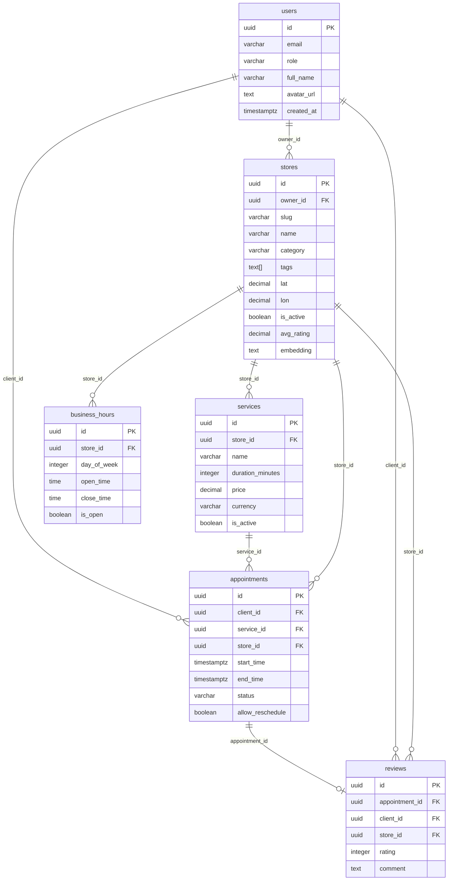

# 05 — Base de Datos — PostgreSQL

## Las 6 tablas y su propósito

| Tabla | Propósito |
|-------|-----------|
| `users` | Todos los usuarios del sistema (admin, emprendedor, cliente) |
| `stores` | Perfiles de negocio con su información, servicios y embedding de IA |
| `services` | Servicios que ofrece cada tienda (corte de cabello, fisioterapia, etc.) |
| `business_hours` | Horarios de apertura por día de la semana para cada tienda |
| `appointments` | Citas agendadas entre un cliente y un servicio de una tienda |
| `reviews` | Reseñas que los clientes dejan tras completar una cita |

---

## Diagrama de relaciones (ERD)



---

## Por qué UUID en lugar de INTEGER para los IDs

Los IDs numéricos autoincrement tienen un problema de seguridad: exponen información interna. Si tu ID de usuario es `47`, un atacante sabe que hay exactamente 46 usuarios registrados antes que tú. Puede iterar de 1 a N y obtener todos los recursos.

Los UUID son impredecibles: `c0d90521-1c24-4623-9357-35a1af5fff27`. Es imposible adivinar o iterar IDs válidos.

Además, los UUID permiten generar IDs en el cliente o en múltiples servidores sin riesgo de colisión — no necesitas consultar la base de datos para saber cuál es el siguiente ID disponible.

Nexo usa la extensión `uuid-ossp` de PostgreSQL:
```sql
CREATE EXTENSION IF NOT EXISTS "uuid-ossp";

-- En cada tabla:
id UUID PRIMARY KEY DEFAULT uuid_generate_v4()
```

---

## Índices — qué son y cuáles tiene Nexo

Un índice en una base de datos funciona igual que el índice de un libro. Sin índice, para encontrar todas las citas de una tienda PostgreSQL tendría que leer **cada fila** de la tabla `appointments`. Con un índice en `store_id`, salta directamente a las filas relevantes.

Nexo tiene 5 índices, cada uno optimizando una consulta frecuente:

| Índice | Columna(s) | Consulta que optimiza |
|--------|-----------|----------------------|
| `idx_appointments_store_time` | `(store_id, start_time)` | Buscar citas de una tienda en un rango de fechas — usada para calcular disponibilidad |
| `idx_appointments_client` | `(client_id)` | Listar las citas de un cliente en su dashboard |
| `idx_stores_category` | `(category)` | Filtrar tiendas por categoría en la pantalla Explore |
| `idx_stores_location` | `(lat, lon)` | Calcular distancias para el sistema de recomendaciones |
| `idx_stores_active` | `(is_active)` | Filtrar tiendas activas en todas las consultas públicas |

El índice compuesto `(store_id, start_time)` es especialmente importante: la verificación de disponibilidad se ejecuta en cada apertura del modal de reserva, por lo que su velocidad impacta directamente la experiencia del usuario.

---

## La columna `embedding` en stores

```sql
stores.embedding TEXT
```

Esta columna guarda el "mapa semántico" de cada tienda: un array de 768 números flotantes serializado como JSON. Ejemplo simplificado:

```json
[0.0234, -0.1823, 0.4521, 0.0089, ..., 0.3341]
```

### Cómo se genera

Cuando se crea o actualiza una tienda, el backend concatena sus atributos descriptivos:
```
"Salón Valentina belleza corte cabello coloración manicure pedicure"
```

Ese texto se envía al modelo `nomic-embed-text` de Ollama, que devuelve el vector de 768 dimensiones. Este vector captura el *significado semántico* — no solo las palabras exactas sino el concepto.

### Cómo se usa en el chatbot

Cuando un usuario escribe "quiero acicalarme", el backend genera el embedding de "arreglo personal corte cabello" (la intención normalizada) y lo compara contra los embeddings de todas las tiendas usando similitud coseno. Las tiendas más similares semánticamente tienen scores más altos.

El vector se guarda como texto porque PostgreSQL 15 no tiene un tipo nativo de vector. Para escalar este sistema a millones de tiendas, se usaría la extensión `pgvector` que permite búsquedas vectoriales indexadas. Para el scope actual es suficiente con el cálculo en Node.js.

---

## Constraints importantes y qué protegen

| Constraint | Tabla | Protege contra |
|-----------|-------|----------------|
| `UNIQUE(store_id, day_of_week)` | `business_hours` | Que una tienda tenga dos registros para el mismo día de la semana |
| `CHECK (role IN ('admin', 'emprendedor', 'cliente'))` | `users` | Valores de rol inválidos |
| `CHECK (day_of_week BETWEEN 0 AND 6)` | `business_hours` | Días de la semana fuera del rango 0-6 |
| `CHECK (status IN ('pending','confirmed',...))` | `appointments` | Estados de cita inválidos |
| `CHECK (rating BETWEEN 1 AND 5)` | `reviews` | Calificaciones fuera del rango 1-5 |
| `UNIQUE` en `appointment_id` | `reviews` | Que el mismo cliente deje más de una reseña por cita |
| `UNIQUE` en `stores.slug` | `stores` | Slugs duplicados en URLs de tiendas |

---

## Cómo se inicializa la DB automáticamente

PostgreSQL tiene una convención: al iniciar por primera vez (cuando el volumen de datos está vacío), ejecuta automáticamente todos los archivos `.sql` que encuentre en `/docker-entrypoint-initdb.d/`.

En `docker-compose.yml` hay este bind mount:

```yaml
volumes:
  - ./infra/init.sql:/docker-entrypoint-initdb.d/init.sql
```

Resultado: la primera vez que levanta el contenedor `db`, PostgreSQL crea todas las tablas, constraints e índices definidos en `infra/init.sql` sin que tengas que hacer nada manualmente.

> 📝 **Nota:** Esta inicialización solo ocurre cuando el volumen `postgres_data` está vacío. Si ya existe el volumen con datos, PostgreSQL omite este paso. Para forzar una reinicialización: `docker compose down -v` (borra el volumen) y luego `docker compose up`.

---

## El script de seed

`backend/scripts/seed.js` crea datos de prueba para desarrollo:

- 1 usuario admin
- 3 emprendedores con sus tiendas configuradas
- 1 cliente
- Servicios, horarios de apertura, citas de ejemplo y reseñas para cada tienda
- **Genera y guarda el embedding de cada tienda** — importante para que el chatbot funcione

```bash
# Correr el seed
docker compose exec backend node scripts/seed.js

# Usuarios creados:
# Admin:         admin@nexo.app       / Admin1234!
# Emprendedores: valentina@nexo.app   / Emprendedor123!
#                carlos.martinez@nexo.app
#                andres.lopez@nexo.app
# Cliente:       cliente1@nexo.app    / Cliente123!
```

> ⚠️ **Importante:** El seed puede correrse múltiples veces — usa `INSERT ... ON CONFLICT DO NOTHING` para no crear duplicados. Si los embeddings están vacíos, el chatbot no mostrará tiendas aunque los scores sean altos.

---

## Comandos psql útiles

```bash
# Conectarse a psql dentro del contenedor
docker compose exec db psql -U nexo_user -d nexo

# Dentro de psql:

# Ver todas las tablas
\dt

# Ver estructura de una tabla
\d appointments

# Consultas útiles para debugging
SELECT id, email, role FROM users;
SELECT id, name, slug, is_active, avg_rating FROM stores;
SELECT id, name, store_id, duration_minutes, price FROM services;

# Ver citas pendientes
SELECT a.id, u.email, s.name, a.start_time, a.status
FROM appointments a
JOIN users u ON u.id = a.client_id
JOIN services s ON s.id = a.service_id
WHERE a.status = 'pending';

# Ver si las tiendas tienen embeddings generados
SELECT name, CASE WHEN embedding IS NULL THEN 'SIN EMBEDDING' ELSE 'OK' END AS embedding_status
FROM stores;

# Salir de psql
\q
```

---

## ¿Qué sigue?

Entender el sistema de IA → [06 — Sistema de IA](./06-ia.md)
