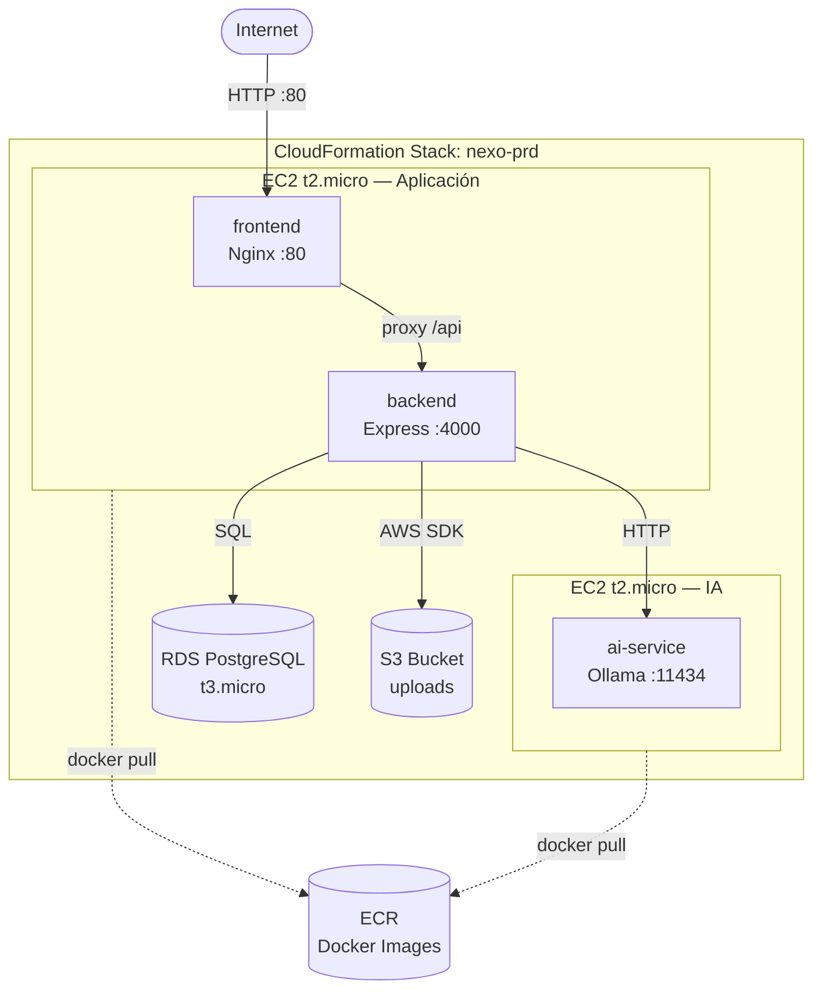

# 07 — Despliegue en AWS — Guía Paso a Paso

## Arquitectura final en AWS



Todo lo que está dentro del rectángulo "CloudFormation Stack" se crea y se elimina con un solo comando. Cuando eliminas el stack, el costo vuelve a $0.

---

## ¿Qué es ECS y por qué usarlo?

Con Docker Compose directo en una EC2, si un contenedor falla, simplemente se queda caído hasta que alguien lo reinicie manualmente. No hay monitoreo, no hay restart automático.

**ECS (Elastic Container Service)** es el servicio de AWS para gestionar contenedores. Con ECS, si un contenedor falla, ECS lo detecta y lo reinicia automáticamente. Si la EC2 falla, ECS puede lanzar una nueva y correr los contenedores en ella.

Nexo usa **ECS con EC2 launch type**: la infraestructura corre en instancias EC2 que tú controlas (y que entran en el Free Tier), pero ECS gestiona qué contenedores corren en ellas.

### Conceptos clave de ECS

| Concepto | Equivalente en Docker Compose | Descripción |
|----------|------------------------------|-------------|
| **Task Definition** | Sección `service` en compose | Define la imagen, CPU, RAM, variables de entorno de un contenedor |
| **Service** | `restart: unless-stopped` | Cuántas instancias de una Task Definition mantener corriendo |
| **Cluster** | El host donde corre Docker | El grupo de EC2s donde ECS ejecuta las Tasks |

---

## Servicios AWS que se usarán

| Servicio | Para qué | Free Tier |
|----------|----------|-----------|
| EC2 t2.micro (×2) | Correr los contenedores | 750 horas/mes total — 12 meses |
| RDS PostgreSQL t3.micro | Base de datos gestionada | 750 horas/mes — 12 meses |
| S3 | Almacenamiento de imágenes subidas | 5GB + 20K GETs + 2K PUTs — 12 meses |
| ECR | Registro privado de imágenes Docker | 500MB — siempre gratis |
| ECS | Orquestación de contenedores | Gratis (pagas la EC2) — siempre |
| CloudFormation | Infraestructura como código | Gratis — siempre |

> ⚠️ **Importante:** El Free Tier de EC2 cubre 750 horas/mes **entre todas las instancias t2.micro de tu cuenta**. Con 2 instancias corriendo las 24h del mes usas ~1.440 horas — el doble del límite. La estrategia es: levantar el stack para probar, eliminarlo cuando termines. 1 hora de prueba con 2 EC2 + RDS cuesta aproximadamente $0.02 USD.

---

## Preparación previa — una sola vez

### 1. Crear usuario IAM (nunca usar el usuario root)

El usuario root de AWS tiene acceso total e ilimitado a tu cuenta. Si alguien obtiene esas credenciales, puede generar miles de dólares en recursos. La práctica estándar es crear un usuario IAM con permisos de administrador para el trabajo del día a día.

```bash
# En la consola web de AWS:
# IAM → Users → Create user
# Nombre: nexo-deploy
# Adjuntar política: AdministratorAccess
# Crear access key → descargar el CSV con las credenciales
```

### 2. Configurar AWS CLI

```bash
# Instalar AWS CLI si no lo tienes:
# Windows: https://aws.amazon.com/cli/  (instalador .msi)
# Mac:     brew install awscli
# Linux:   sudo apt install awscli

# Configurar con las credenciales del usuario IAM
aws configure
# AWS Access Key ID: [pegar del CSV]
# AWS Secret Access Key: [pegar del CSV]
# Default region name: us-east-1
# Default output format: json

# Verificar que funciona
aws sts get-caller-identity
```

### 3. Configurar alerta de billing

Antes de hacer cualquier despliegue, configura una alerta que te avise si el costo sube de $1:

```
Consola AWS → Billing → Budgets → Create budget
Tipo: Cost budget
Límite: $1.00 USD
Alert: 80% del límite → enviar email
```

---

## Paso 1 — Construir y subir imágenes a ECR

ECR (Elastic Container Registry) es como Docker Hub pero dentro de tu cuenta AWS. Las imágenes que subes ahí solo son accesibles por tus servicios AWS.

```bash
# Variables (reemplaza con tu cuenta real)
AWS_ACCOUNT_ID=123456789012
AWS_REGION=us-east-1
ECR_BASE=$AWS_ACCOUNT_ID.dkr.ecr.$AWS_REGION.amazonaws.com

# 1. Crear los repositorios en ECR (solo la primera vez)
aws ecr create-repository --repository-name nexo-frontend --region $AWS_REGION
aws ecr create-repository --repository-name nexo-backend --region $AWS_REGION
aws ecr create-repository --repository-name nexo-ai-service --region $AWS_REGION

# 2. Autenticarse en ECR
aws ecr get-login-password --region $AWS_REGION | \
  docker login --username AWS --password-stdin $ECR_BASE

# 3. Build y push del backend
docker build -t nexo-backend ./backend
docker tag nexo-backend:latest $ECR_BASE/nexo-backend:latest
docker push $ECR_BASE/nexo-backend:latest

# 4. Build y push del frontend
docker build -t nexo-frontend ./frontend
docker tag nexo-frontend:latest $ECR_BASE/nexo-frontend:latest
docker push $ECR_BASE/nexo-frontend:latest

# 5. Build y push del ai-service
docker build -t nexo-ai-service ./ai-service
docker tag nexo-ai-service:latest $ECR_BASE/nexo-ai-service:latest
docker push $ECR_BASE/nexo-ai-service:latest
```

> 💡 **Tip:** El Free Tier de ECR incluye 500MB. Las imágenes de Nexo suman aproximadamente:
> - backend: ~150MB (node:20-alpine + deps)
> - frontend: ~25MB (nginx:alpine + archivos compilados)
> - ai-service: ~1.2GB (ollama/ollama es grande)
>
> El ai-service supera el límite gratuito. Para minimizar costos, elimina las imágenes de ECR cuando no las uses: `aws ecr batch-delete-image --repository-name nexo-ai-service --image-ids imageTag=latest`

---

## Paso 2 — La plantilla CloudFormation

CloudFormation es la herramienta de AWS para describir toda tu infraestructura en un archivo YAML. Es como `docker-compose.yml` pero para servicios cloud completos.

La plantilla de Nexo (`infra/aws/nexo-stack.yml`) crea estos recursos en orden:

1. **VPC y subnets** — la red privada donde viven los recursos
2. **Security Groups** — reglas de firewall: el backend puede hablar con RDS, el frontend puede recibir tráfico HTTP
3. **RDS PostgreSQL** — la base de datos gestionada por AWS
4. **S3 Bucket** — para las imágenes subidas por los usuarios
5. **ECS Cluster** — el agrupador de EC2s
6. **EC2 #1** con ECS Agent — la máquina para frontend + backend
7. **EC2 #2** con ECS Agent — la máquina para Ollama
8. **Task Definitions** — la configuración de cada contenedor (imagen ECR, CPU, RAM, env vars)
9. **ECS Services** — le dice a ECS "mantén siempre 1 instancia de cada Task corriendo"

La plantilla acepta parámetros para no hardcodear valores sensibles:

```yaml
Parameters:
  DBPassword:
    Type: String
    NoEcho: true
  JWTSecret:
    Type: String
    NoEcho: true
  ECRAccountId:
    Type: String
```

---

## Paso 3 — Desplegar el stack completo

```bash
# Crear o actualizar el stack (el mismo comando sirve para ambos)
aws cloudformation deploy \
  --template-file infra/aws/nexo-stack.yml \
  --stack-name nexo-prd \
  --capabilities CAPABILITY_IAM \
  --parameter-overrides \
    DBPassword=TuPasswordSeguro123! \
    JWTSecret=tuJWTsecretSuperLargoYRandom \
    ECRAccountId=$AWS_ACCOUNT_ID

# Monitorear el progreso en tiempo real (tarda 5-15 minutos)
aws cloudformation describe-stack-events \
  --stack-name nexo-prd \
  --query 'StackEvents[*].[ResourceStatus,ResourceType,ResourceStatusReason]' \
  --output table

# Ver las URLs cuando termine (outputs del stack)
aws cloudformation describe-stacks \
  --stack-name nexo-prd \
  --query 'Stacks[0].Outputs' \
  --output table
```

Los outputs incluirán la IP pública de EC2 #1 (donde está el frontend) y el endpoint de RDS.

---

## Paso 4 — Inicializar la base de datos en RDS

```bash
# Obtener el endpoint de RDS del stack
RDS_ENDPOINT=$(aws cloudformation describe-stacks \
  --stack-name nexo-prd \
  --query 'Stacks[0].Outputs[?OutputKey==`RDSEndpoint`].OutputValue' \
  --output text)

# Conectarse a RDS y ejecutar init.sql
psql -h $RDS_ENDPOINT -U nexo_user -d nexo -f infra/init.sql

# Ejecutar el seed para datos de prueba
# (desde una EC2 con acceso a RDS, o usando un tunnel SSH)
psql -h $RDS_ENDPOINT -U nexo_user -d nexo \
  -c "$(cat backend/scripts/seed-prd.sql)"
```

---

## Paso 5 — Verificar que todo funciona

```bash
# Obtener la IP pública de la EC2 de aplicación
EC2_IP=$(aws cloudformation describe-stacks \
  --stack-name nexo-prd \
  --query 'Stacks[0].Outputs[?OutputKey==`AppEC2IP`].OutputValue' \
  --output text)

# Verificar que el frontend responde
curl http://$EC2_IP

# Verificar que el backend responde
curl http://$EC2_IP/api/health

# Ver logs del backend en ECS
aws logs get-log-events \
  --log-group-name /ecs/nexo-backend \
  --log-stream-name $(aws logs describe-log-streams \
    --log-group-name /ecs/nexo-backend \
    --query 'logStreams[-1].logStreamName' --output text) \
  --limit 50
```

**Checklist de verificación:**
- [ ] `http://<IP>/` → Muestra la landing de Nexo
- [ ] `http://<IP>/api/health` → `{ "status": "ok" }`
- [ ] Login con `cliente1@nexo.app` / `Cliente123!` funciona
- [ ] El chatbot responde (puede tardar 30–60s en la primera petición)
- [ ] Las imágenes de las tiendas cargan correctamente (S3)

---

## ⚠️ Apagar todo para no generar costos — MUY IMPORTANTE

```bash
# ELIMINAR el stack completo
# Esto elimina: EC2s, RDS, S3 (contenido incluido), ECS, todo
# El costo vuelve a $0 inmediatamente
aws cloudformation delete-stack --stack-name nexo-prd

# Verificar que se está eliminando (puede tardar 5-15 minutos)
aws cloudformation describe-stacks --stack-name nexo-prd

# Cuando muestre "does not exist" el stack fue eliminado

# Verificar que no quedan instancias EC2 corriendo
aws ec2 describe-instances \
  --filters "Name=instance-state-name,Values=running" \
  --query 'Reservations[*].Instances[*].[InstanceId,InstanceType,Tags[?Key==`Name`].Value|[0]]' \
  --output table

# Verificar que no quedan instancias RDS
aws rds describe-db-instances \
  --query 'DBInstances[*].[DBInstanceIdentifier,DBInstanceStatus,DBInstanceClass]' \
  --output table
```

> ⚠️ **Importante:** Después de `delete-stack`, verifica en la **consola web de AWS** (console.aws.amazon.com → EC2 y RDS) que no queden instancias corriendo. CloudFormation puede fallar al eliminar recursos con dependencias y dejarlos huérfanos, generando costos aunque no los uses. Un RDS olvidado a $0.02/hora son $14.40/mes.

---

## Diferencias entre dev local y producción AWS

| Aspecto | Dev local | Producción AWS |
|---------|-----------|---------------|
| Base de datos | Contenedor Docker en tu PC | RDS gestionado por AWS (backups automáticos) |
| Storage de imágenes | Volumen Docker (`/app/uploads`) | AWS S3 (redundante, escalable) |
| AI service | Comparte host con frontend/backend | EC2 dedicada (necesita ~1GB RAM) |
| Arranque desde cero | ~2 min (con modelos en volumen) | ~15 min (primera vez, descarga modelos) |
| Costo | $0 | ~$0.02/hora con 2 EC2 + RDS |
| Reinicio automático | No | Sí (ECS Service restart policy) |
| Health checks | No | Sí (ECS Task health checks) |

---

## Flujo de trabajo recomendado

```
Desarrollo diario
└─ local con Docker → make dev → cambios en tiempo real

Cuando quieres probar en AWS
└─ aws cloudformation deploy → esperar ~15 min → probar → delete-stack
   Costo: ~$0.10 por una hora de prueba completa

Antes de hacer un demo o presentación
└─ deploy el día anterior → hacer demo → delete-stack
   Costo: ~$0.50 por un día completo activo
```

El stack de CloudFormation es **idempotente**: si lo vuelves a crear después de eliminarlo, el resultado es exactamente el mismo. Puedes crear y eliminar el stack tantas veces como necesites sin efectos secundarios.

---

## ¿Qué sigue?

Has completado la documentación técnica de Nexo. Para volver al inicio: [Índice de documentación](./README.md)
